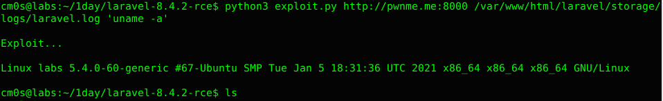

# laravel-8.4.2-rce

## Setup enviroment
```bash
git clone https://github.com/laravel/laravel.git
cd laravel
git checkout e849812
composer install
composer require facade/ignition==2.5.1
php artisan serve
```

## Usage

```bash
python3 exploit.py http://pwnme.me:8000 /var/www/html/laravel/storage/logs/laravel.log 'uname -a'
```


## References
[Laravel <= v8.4.2 debug mode RCE](https://www.ambionics.io/blog/laravel-debug-rce)
